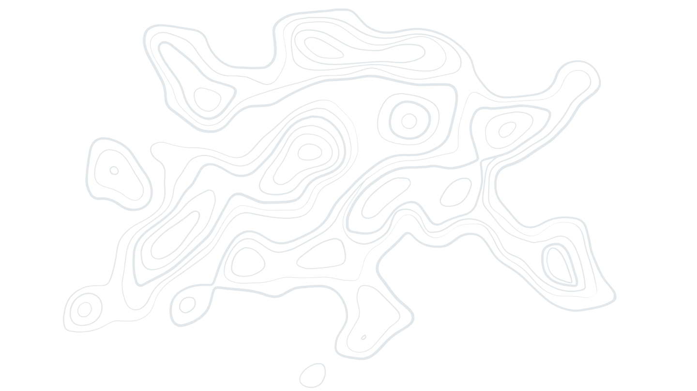

East Africa Hazards Watch
===================================

The `East Africa Hazards Watch <https://eahazardswatch.icpac.net/>`_ supports tracking extreme events such as drought, cyclones, pests (desert locust), heavy rainfall, floods or crop failures, which are increasing in frequency and intensity due to climate change.

The system was developed by a team of Programmers, Climate Scientists, Earth Observation and Systems specialists, as well as Marketing, Design Thinking and sectoral experts to meet the growing need of Risk Information due to increasing climate extremes.

.. seealso:: To download a PDF version of this guide use :download:`East Africa Hazards Watch Manual <https://eahazardswatch.readthedocs.io/_/downloads/en/latest/pdf/>` 

About
--------

.. toctree::
   :maxdepth: 2
   :caption: About

   /About/general_information
